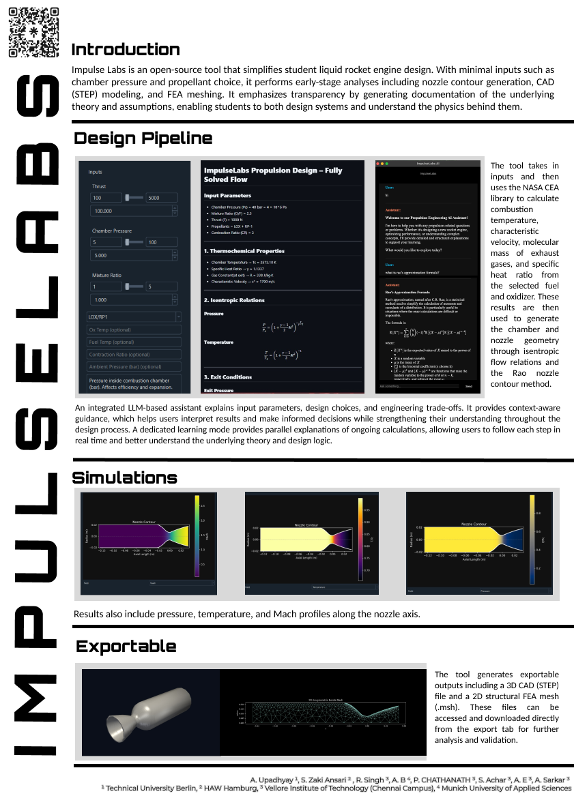

# ImpulseLabs

### Open-Source Liquid Rocket Engine Design Platform

---

  

---

## Overview

ImpulseLabs is an open-source propulsion design environment developed to streamline and standardize the preliminary design workflow of liquid rocket engines.

Conventional student and early-stage propulsion projects often depend on fragmented tools such as spreadsheets, isolated calculators, and opaque solvers. These approaches typically produce results without clarity, leading to weak conceptual understanding and inconsistent design methodologies.

ImpulseLabs addresses this by integrating combustion modeling, isentropic flow analysis, nozzle contour generation, and export-ready geometry into a unified, transparent framework. The system is designed not only to compute results but to clearly expose the underlying physics, assumptions, and relationships between parameters.

---

## Objective

The primary objectives of ImpulseLabs are:

* To unify early-stage propulsion design into a single coherent workflow
* To provide transparency in all calculations and assumptions
* To reinforce conceptual understanding alongside computation
* To enable rapid and reproducible design iteration
* To support open collaboration in propulsion engineering

---

## Core Capabilities

### Combustion Modeling

ImpulseLabs integrates RocketCEA, based on NASA’s Chemical Equilibrium with Applications (CEA), to compute equilibrium combustion properties.

Outputs include:

* Combustion temperature ($T_c$)
* Characteristic velocity ($c^*$)
* Ratio of specific heats ($\gamma$)
* Molecular weight of exhaust gases ($M_w$)

These parameters define the thermodynamic state of the flow entering the nozzle.

---

### Isentropic Flow Analysis

The tool performs one-dimensional steady isentropic flow calculations to determine expansion behavior within the nozzle.

Key computations:

* Exit Mach number ($M_e$) from pressure ratio
* Expansion ratio ($\epsilon = A_e/A_t$)
* Flow property distributions along the nozzle

Derived quantities:

* Velocity profile
* Temperature distribution
* Pressure variation

---

### Nozzle Geometry Generation

ImpulseLabs generates a full nozzle profile based on physical constraints and flow requirements.

Components:

* Converging section (parabolic profile)
* Throat region (smoothed transition)
* Diverging section using Rao’s approximation

The Rao method provides a shortened bell nozzle that closely approximates optimal expansion while reducing length and mass.

---

### Mass Flow and Thrust Coupling

The relationship between combustion conditions and thrust is explicitly modeled:

$$
\dot{m} = \frac{P_c A_t}{c^*}
$$

$$
F = \dot{m} v_e + (P_e - P_a) A_e
$$

This links chamber pressure, throat area, and exhaust conditions directly to thrust output.

---

### Mesh Generation

ImpulseLabs generates structured 2D axisymmetric meshes suitable for CFD analysis.

Features:

* Boundary-aware refinement
* Higher resolution near throat and chamber
* Export in `.msh` format

---

### 3D CAD Generation

The tool produces 3D nozzle geometries via revolution of the 2D contour.

Export capabilities:

* STEP format (`.step`)
* Compatible with standard CAD and simulation tools

---

### Visualization

ImpulseLabs provides physically meaningful visualization of flow behavior within the nozzle.

Available fields:

* Mach number / velocity (Viridis colormap)
* Temperature (Inferno colormap)
* Pressure (Cividis colormap)

These visualizations allow users to observe acceleration, expansion, and thermal changes along the nozzle.

---

### Learning Mode

A dedicated learning interface exposes the internal calculations performed by the tool.

Features:

* Step-by-step explanation of computations
* Markdown and LaTeX rendering
* Explicit display of governing equations

This transforms the platform into a hybrid design and educational system.

---

### LLM Integration (Experimental)

ImpulseLabs includes a configurable language model interface for:

* Explaining input parameters
* Interpreting simulation outputs
* Providing conceptual guidance

This component is optional and requires user-supplied API credentials.

---

## Workflow

ImpulseLabs follows a structured computational pipeline:

1. Input definition
2. Combustion analysis (RocketCEA)
3. Isentropic flow solution
4. Nozzle geometry generation
5. Mesh generation
6. Export of simulation and CAD assets

Each stage is explicitly connected, ensuring traceability of results.

---

## Assumptions

* One-dimensional steady isentropic flow
* Ideal gas behavior
* Chemical equilibrium at chamber conditions
* Negligible viscous and boundary layer effects
* No heat transfer modeling

---

## Limitations

* No transient or startup modeling
* No combustion instability analysis
* No regenerative cooling or thermal stress modeling
* No shock-induced separation prediction

---

## Prerequisites

Before using ImpulseLabs, ensure the following dependencies are available:

* Python 3.10 or 3.11 (recommended for stability)
* `rocketcea`
* `numpy`
* `scipy`
* `matplotlib`
* `cadquery`
* `pyvista` and `pyvistaqt`
* `meshio`
* `PySide6` and `PySide6-WebEngine`
* `markdown`

A working OpenGL environment is required for 3D visualization.

---

## Installation

Detailed installation steps are available in:

`docs/INSTALLATION.md`

---

## Documentation

Complete theoretical and implementation details are provided in:

`docs/DOCUMENTATION.md`

---

## Example Use Case

Input:

* Thrust: 1000 N
* Chamber Pressure: 30 bar
* Mixture Ratio: 2.5

Output:

* Exit Mach ≈ 3.2
* Expansion Ratio ≈ 7
* Nozzle Length ≈ 0.12 m

---

## Future Development

Planned extensions include:

* Real gas and non-equilibrium flow modeling
* Boundary layer and viscous corrections
* Transient engine simulation
* Automated optimization modules
* Direct integration with CFD solvers
* Multi-stage propulsion modeling

---

## Sponsorship and Collaboration

ImpulseLabs is open to collaboration with:

* Academic research groups
* Student propulsion teams
* Aerospace startups
* Open-source contributors

For sponsorship, collaboration, or research inquiries, contact:

---

## Contact

Email: [impulselabs.propulsion@gmail.com](mailto:impulselabs.propulsion@gmail.com)
GitHub: https://github.com/Beyond-Space-Alpha

---

## License

This project is released under the GPL V3.0 License.

---

## Philosophy

ImpulseLabs is built on a fundamental principle:

Engineering tools should not obscure the physics behind results.
They should make those principles accessible, transparent, and actionable.
